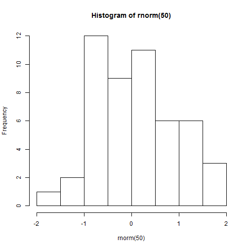
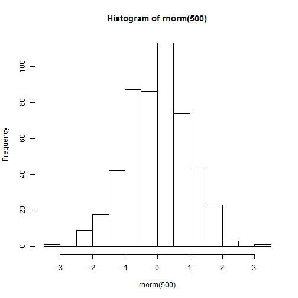

Sample Size and Normal Distribution
========================================================
author: R Sherrod
date: 12/20/2015
autosize: true

Introduction
========================================================

Sampling from a normal distribution is an important feature in R.  

- Sample size is critical
- The sampling distribution approaches normality as the sample size is increases
- Small samples can lead to misleading results


Sample Size and Distribution, Sample Size=50 
========================================================


```r
hist(rnorm(50))
```

 
Sample Size and Distribution, Sample Size=50 
========================================================


```r
hist(rnorm(500))
```

 

Conclusion
========================================================

Always use sufficiently large samples when trying to approximate a normal distribution.

- The sampling distribution approaches normality as the sample size is increases
- Small samples can lead to misleading results

